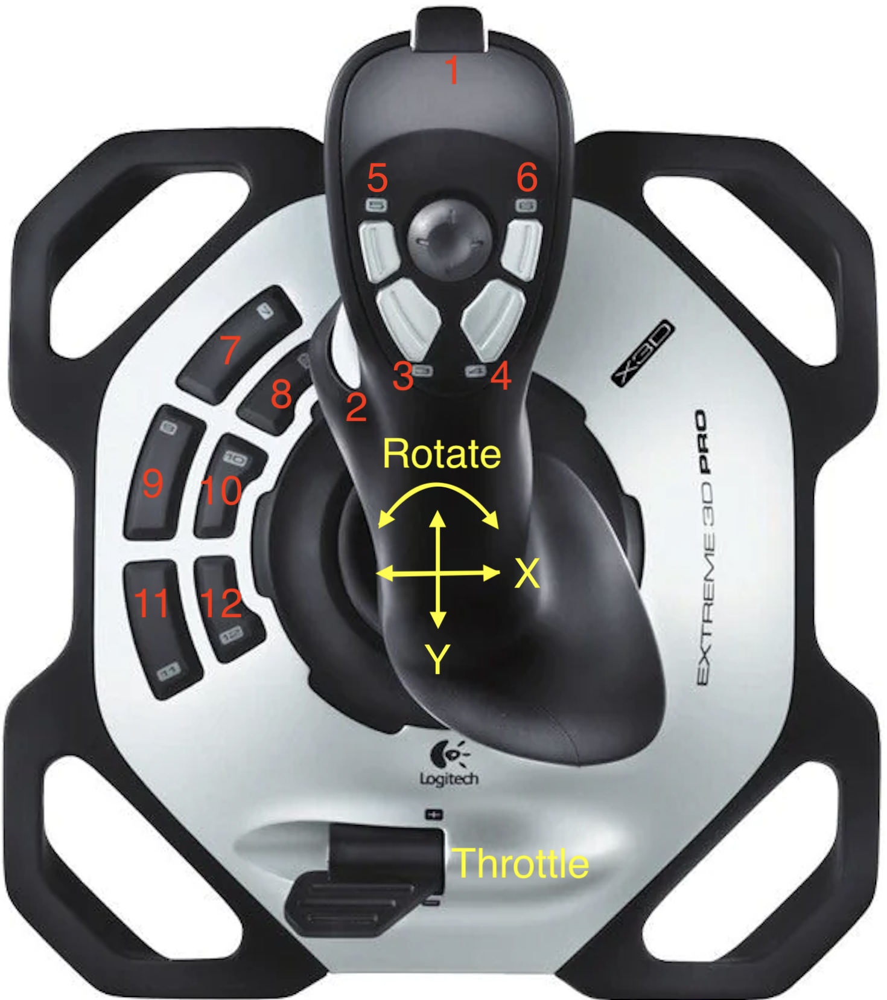
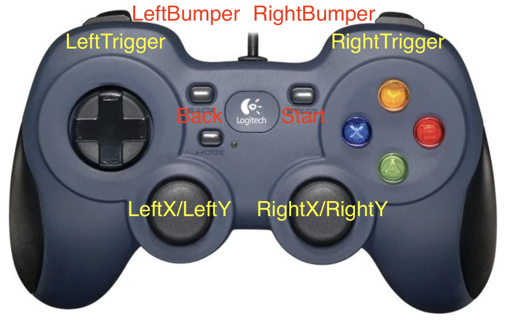

# Controller Map

> Red means btn and yellow means axis.

## Driver

| Btn/Axis | Action               |
| -------- | -------------------- |
| X        | Chassis X Speed      |
| Y        | Chassis Y Speed      |
| Rotate   | Chassis ω Speed      |
| Throttle | Chassis Throttle     |
| 1        | Brake                |
| 2        | Drive Robot Relative |
| 7        | Lock X Speed         |
| 8        | Lock Y Speed         |
| 9        | Lock ω Speed         |
| 11       | reset gyro           |

## Copilot

| Btn/Axis     | Action                                  |
| ------------ | --------------------------------------- |
| LeftTrigger  | Tweak Chassis -Y Speed (Robot Relative) |
| RightTrigger | Tweak Chassis +Y Speed (Robot Relative) |
| povUP        | Chassis turn to 0 deg                   |
| povLeft      | Chassis turn to 120 deg                 |
| povDown      | Chassis turn to 180 deg                 |
| povRight     | Chassis turn to -120 deg                |
| Back         | Chassis turn to 90 deg                  |
| LeftBumper   | Chassis turn to -90 deg                 |
| A            | Shoot Amp                               |
| B            | Auto Aim & Take Note                    |
| X            | Take Note                               |
| Y            | Shoot Speaker                           |
| Start        | Eject Note                              |
| RightBumper  | Trigger                                 |

